# Threat Composer — ECS Deployment on AWS 🚀


## Overview

I built a containerised web application and deployed it on AWS with a custom domain, HTTPS, and fully automated infrastructure. The app runs in a Docker container stored in ECR, orchestrated by ECS Fargate inside a custom VPC, sitting behind an Application Load Balancer that handles HTTPS using an ACM certificate, accessible via a Cloudflare DNS record pointing to the ALB. All infrastructure is defined as Terraform code organised into modules, with state stored remotely in S3. Deployments are fully automated through GitHub Actions CI/CD pipelines.

The application itself is Amazon's open source Threat Composer tool — a threat modelling application designed to help development and security teams brainstorm and document potential security threats early in the design phase. Rather than building an app from scratch, the focus of this project was building production-grade infrastructure around a real-world application.

---

## Live Demo 🌐

**Live URL:** [https://tm.mohamedahmed.uk](https://tm.mohamedahmed.uk)

### App Running Live with HTTPS
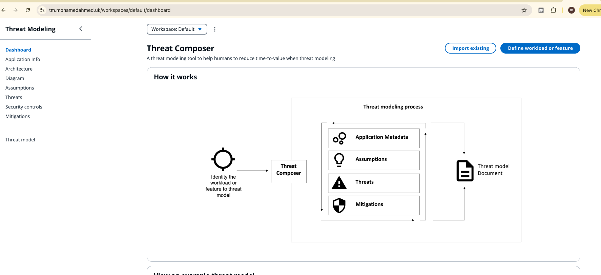

### HTTPS Connection Secure
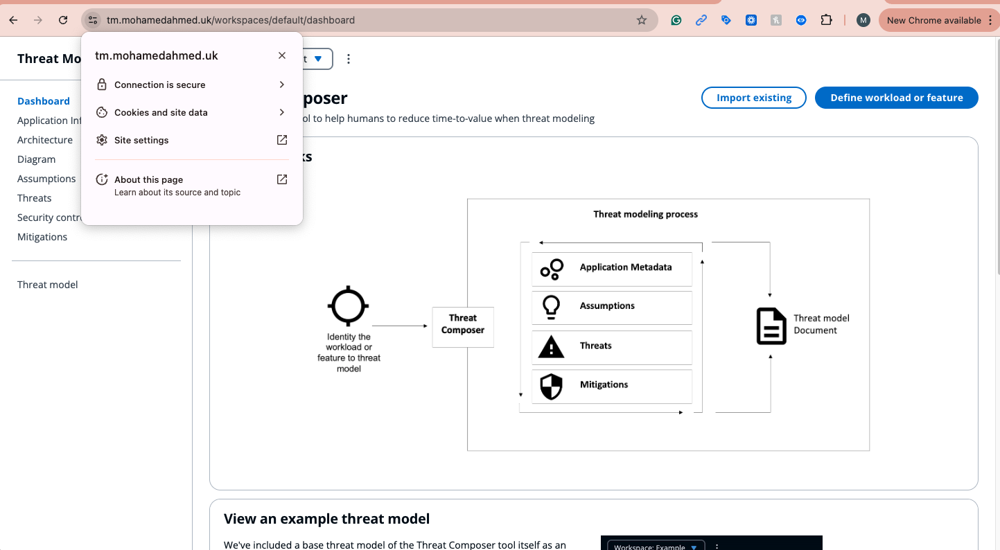

### Health Endpoint
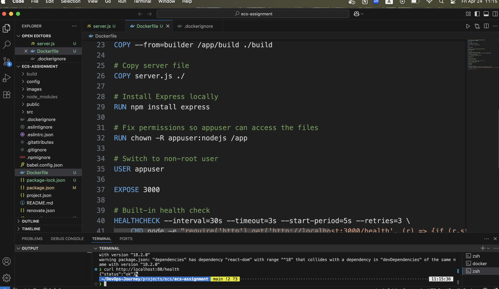

---

## Deployment Evidence 📸

### Docker Container Running Locally
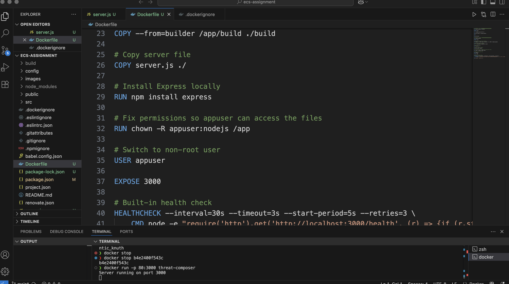

### ECR Repository with Pushed Image
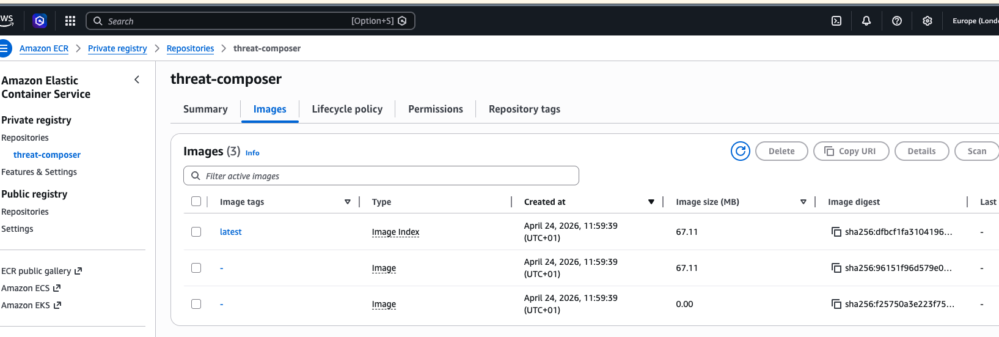

### ECS Cluster Running
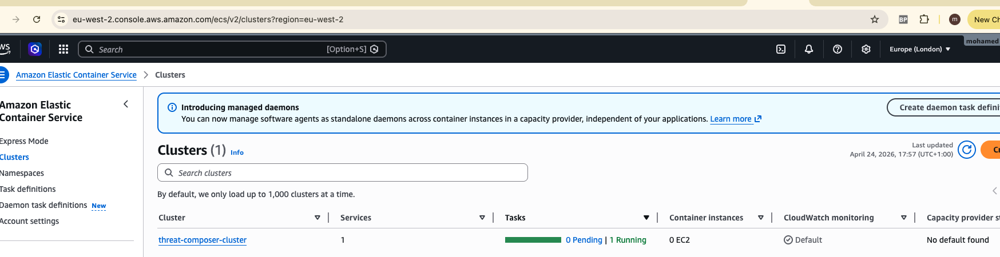

### Target Group Healthy
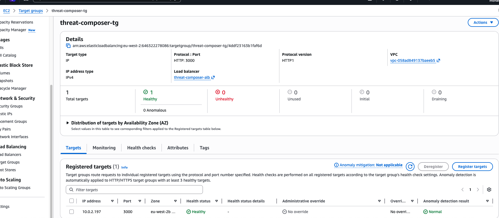

### ACM Certificate Issued
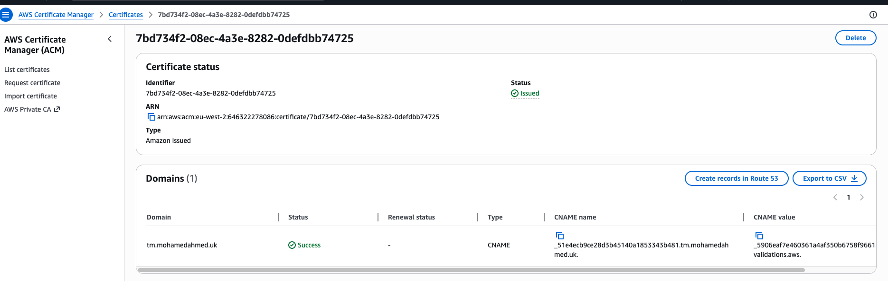

## Architecture 🏗️

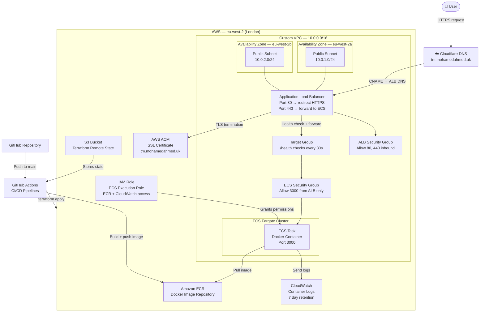

---

## Project Structure 📁
```
.
├── src/                        # Threat Composer source code
├── public/                     # Static assets
├── Dockerfile                  # Multi-stage Docker build
├── .dockerignore               # Files excluded from Docker image
├── server.js                   # Express server with /health endpoint
├── terraform/                  # All infrastructure as code
│   ├── main.tf                 # Root module — wires all modules together
│   ├── variables.tf            # Input variables
│   ├── outputs.tf              # Output values (ALB DNS, ACM validation)
│   ├── provider.tf             # AWS provider and S3 remote state backend
│   └── modules/
│       ├── vpc/                # VPC, subnets, IGW, route tables, security groups
│       ├── ecr/                # ECR repository and lifecycle policy
│       ├── alb/                # ALB, listeners, target group
│       ├── acm/                # ACM certificate for HTTPS
│       └── ecs/                # ECS cluster, task definition, service, IAM, CloudWatch
├── .github/
│   └── workflows/              # CI/CD pipeline definitions
└── README.md

...
```
---

## Prerequisites ✅

Make sure you have the following installed and configured:

- [Docker](https://docs.docker.com/get-docker/)
- [Node.js](https://nodejs.org/) (v20+)
- [Yarn](https://yarnpkg.com/)
- [Terraform](https://www.terraform.io/downloads) (v1.0+)
- [AWS CLI](https://aws.amazon.com/cli/) configured with appropriate credentials
- An AWS account with sufficient permissions
- A registered domain name

---

## Local Setup 💻

**1. Clone the repository:**
```bash
git clone <your-repo-url>
cd ecs-assignment
```

**2. Install dependencies:**
```bash
yarn install
```

**3. Build the app:**
```bash
yarn build
```

**4. Run locally:**
```bash
node server.js
```

**5. Verify the health endpoint:**
```bash
curl http://localhost:3000/health
# {"status":"ok"}
```

**6. Open in browser:**

http://localhost:3000/workspaces/default/dashboard

---

## Infrastructure Deployment 🏗️

**1. Navigate to the Terraform directory:**
```bash
cd terraform
```

**2. Initialise Terraform:**
```bash
terraform init
```

**3. Preview changes:**
```bash
terraform plan
```

**4. Deploy infrastructure:**
```bash
terraform apply
```

**5. To scale down ECS tasks (stop billing):**
```bash
terraform apply -var="desired_count=0"
```

**6. To destroy all infrastructure:**
```bash
terraform destroy
```

---

## CI/CD Pipelines ⚙️

| Pipeline | Trigger | What it does |
|---|---|---|
| App Pipeline | Push to main (app files) | Builds Docker image, tags with commit SHA, pushes to ECR |
| Terraform Deploy | Push to main (terraform files) | Runs terraform init, fmt, validate, plan, apply + health check |
| Terraform Destroy | Manual trigger | Tears down all infrastructure |

### App Pipeline — Success
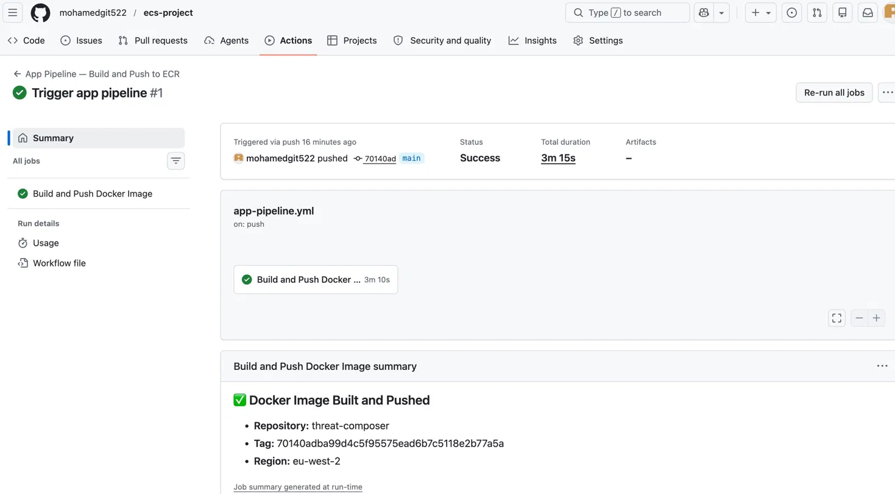

### Terraform Deploy — Success
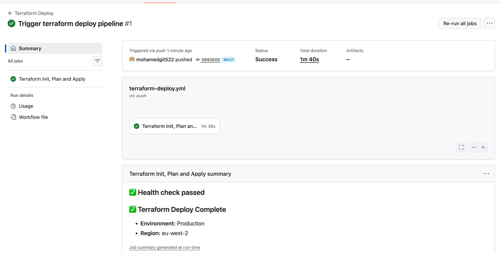

### Terraform Destroy — Success
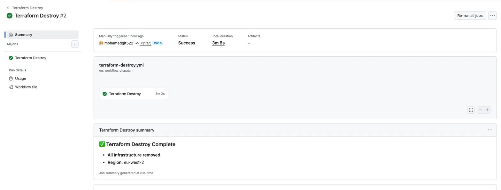
---

## Technologies Used 🛠️

| Category | Technology |
|---|---|
| Cloud | AWS (ECS Fargate, ECR, ALB, VPC, ACM, CloudWatch, IAM, S3) |
| Infrastructure as Code | Terraform |
| Containerisation | Docker |
| CI/CD | GitHub Actions |
| DNS | Cloudflare |
| App | Amazon Threat Composer (open source) |

---

## Key Decisions 📝

**Why ECS Fargate over EC2?**
Fargate is serverless — no servers to manage, patch, or scale manually. You define CPU and memory requirements and AWS handles the rest. Ideal for a containerised workload where the focus is the application, not the infrastructure underneath.

**Why Terraform modules?**
A modular structure keeps infrastructure organised, maintainable, and debuggable. Each module (VPC, ECR, ALB, ECS, ACM) is independently testable and reusable. A single giant file would be impossible to maintain at scale.

**Why S3 remote state?**
Local state only exists on one machine. S3 remote state means the infrastructure record is centralised, versioned, encrypted, and accessible to any team member. State locking prevents concurrent applies from corrupting the state.

**Why port 3000 inside the container?**
Port 80 requires root privileges on Linux. Running as a non-root user (security best practice) means the container must listen on a non-privileged port. The ALB handles public-facing ports 80 and 443.